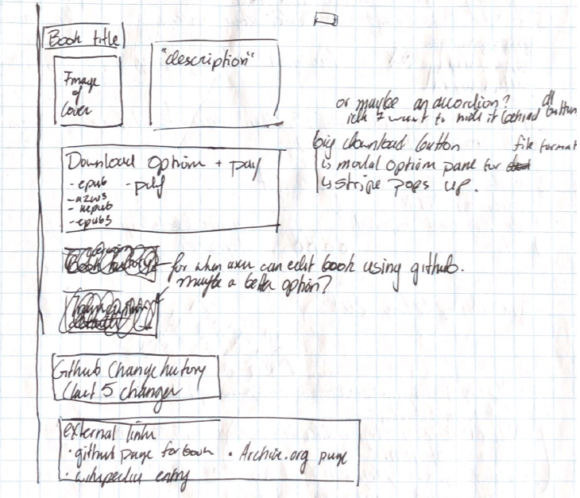

So here's everything I have planned for the project for this week. 

For the **May Demo Night**  @ CUNY Tech prep , I plan to have 3 pages completed with the following priorities:

1. A download page for the book
2. A "browse ebooks" page (paginated or newsfeed-type scroll can't decide yet)
3. An "about the project" page

This is all just for the website, by the way. There are some technical issues I need to figure out about
- scanning the ebooks
- converting them to plain text with some ocr application
- finding a github-like but user friendly system where people can post corrections to the mistakes made by ocr. 
  - [Plans and pricing · Penflip](https://www.penflip.com/pricing)
  - [Plans & Pricing · GitBook](https://www.gitbook.com/pricing)

* * *

This break I will be focusing on the download page which should have the following components:



- Book Title

- Cover Image
- Descrption of the book
- download button
  - download options (modal pane)
  - stripe api credit card info enry for donation (modal pane)
- Github (or whatever scm I'm using) last 5 changes
- external links to 
  - github page (or whatever scm I use)
  - archive.org page
  - wikipedia entry
* * *

## TODO
By **April 17th Demo Night** I will have completed the database (sequelize), middle-ware (express), and front-end (react/bootstrap) work associated with the download page. The rest of the site I will add later on.

My goal for this week is to get the front end working. No middle-ware and no database means no books can be downloaded. I do want to get all the components in the right place and have them make the right api calls that I can build upon later on.

1.  [DONE] Re-introduction to javascript tutorial from MDN
2. [DONE] React Framework tutorial
3.  Bootstrap tutorial
4.  make a front-end mockup with dummy content and a dummy book with working 
    1.  install applicable software on cromebook
    2.  set up a new github
    3.  outline which features can be implemented by which techniques in documentation
    4.  Find an applicable theme
    5.  begin implementation


After the break, I can focus on designing the API to work with the front end.

- Restful reqeusts & routing

- json API design

- database modeling and back-end business logic

* * *

- In order to start the React Tutorial, I had to first install node on my system. Here's how I did that (source from [Orientation Development Environment Setup](https://github.com/CUNYTechPrep/ctp2017/blob/master/lecture-notes/orientation-dev-setup.md) CTP Fall 2017):


The best way to manage your Node.js installations is to use the NVM (Node Version Manager) tool. It allows you to have multiple versions of Node.js installed simultaneously and provides commands to easily switch between different versions.
```bash
# Mac users should run this command first
touch ~/.bash_profile

# Install nvm see [this page](https://github.com/creationix/nvm#install-script) for the current version 
curl -o- https://raw.githubusercontent.com/creationix/nvm/v0.33.8/install.sh | bash

# After nvm installs you should close your terminal and open a new one to access nvm

# Verify that nvm is working
nvm ls

# Install the LTS node.js version (find current lts version at https://nodejs.org/en/)
nvm install 8.11.1

# Install another node.js version
nvm install 8.1.3

# You are now using version 8.1.3, to switch back to 8.11.1 run
nvm use 8.11.1

# Run the node repl (read-eval-print loop)
node
```
The node command runs the interpreter allowing you to run and evaluate JavaScript code. This is similar to running the python, ruby, or php interpreters on the command line, if you are familiar with those languages.

- by the way, installing node includes an installation of `npm` too. Don't have to install them separately.

