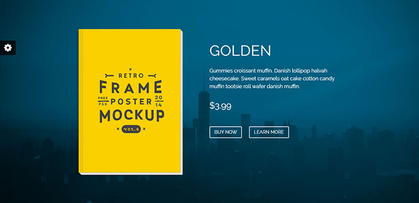

#Final Todo Before Presentation 

1. crop off the bottom of the image and figure out why the corners aren't rounded.

2. take a slip of paper and measure the ratios present on the theme pictured below (go to the actual demo site and do this.) then use custom styles to center the grid, make it smaller (col size 4 for the picture and description) and then make it fit your measurements. 

3. use the custom styles utility to change the color of the navbar

4. place a filtered background of gramos mountains stock photo (doens't need to be copyrighted for the presentation)

5. ask sana about a description of the book

6. make the download button link to archive.org

7. set up the penflip account?

   ​

Make sure you have included all the following:

- Book Title
- Cover Image
- Descrption of the book
- download button
  - download options (modal pane)
  - stripe api credit card info enry for donation (modal pane)
- Github (or whatever scm I'm using) last 5 changes
- external links to 
  - github page (or whatever scm I use)
    - [Plans and pricing · Penflip](https://www.penflip.com/pricing)
    - [Plans & Pricing · GitBook](https://www.gitbook.com/pricing)
  - archive.org page
  - wikipedia entry

